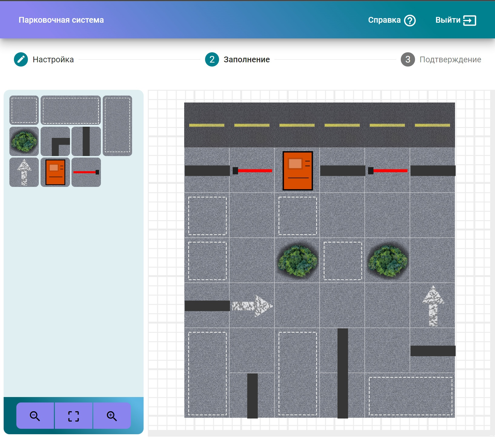
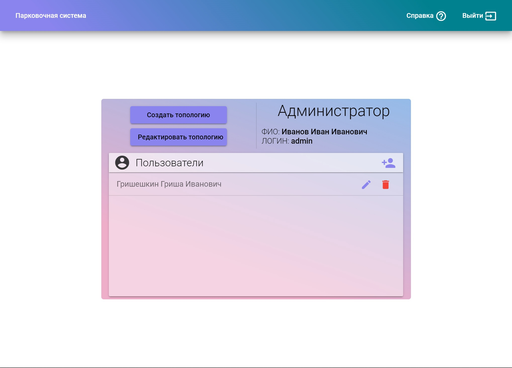
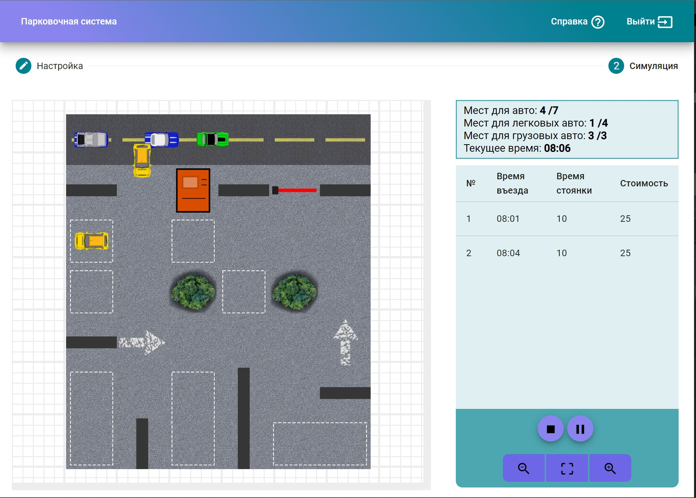
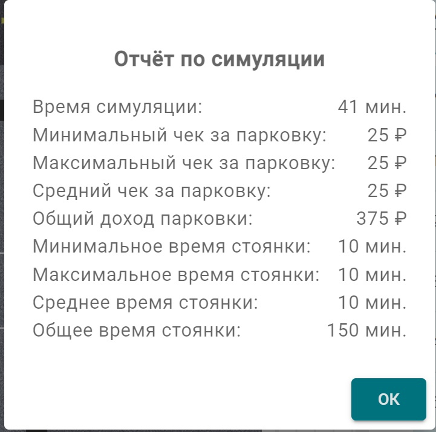
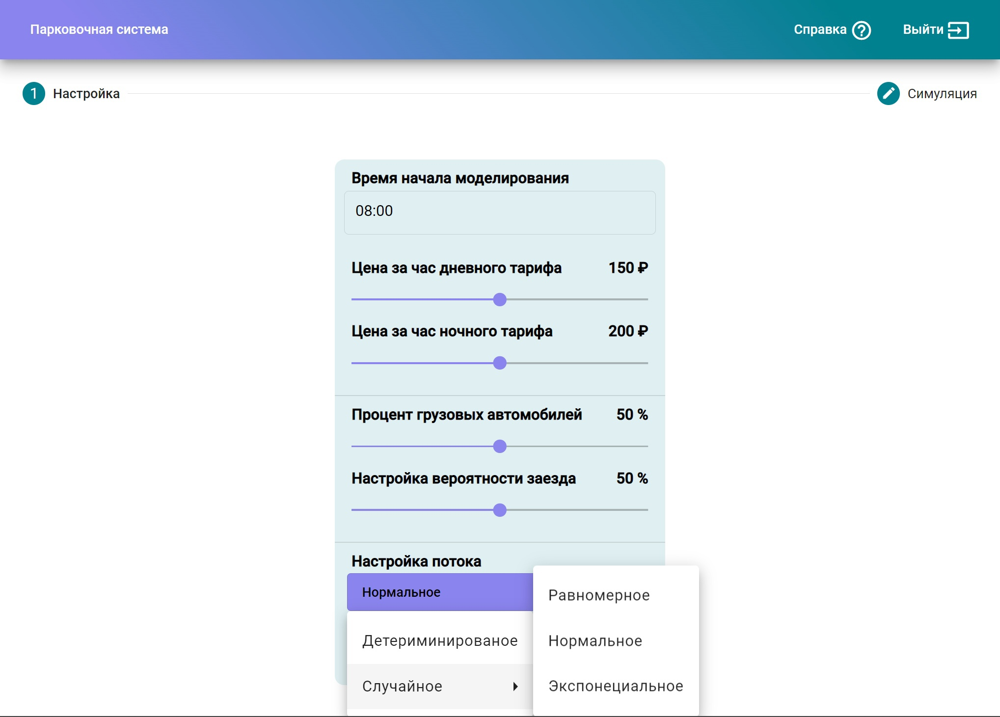

# Конструирование и моделирование работы парковки
Конструктор парковки с возможностью моделирование работы в реальном времени для расчета прибыли.
[🎞️ Демонстрация работы](https://disk.yandex.ru/i/VGacLiE01s87bw)
<p align="center">

</p>

## Возможности
⚡ Создание/Редактирование парковок

⚡ Размещение статических объектов: паркоматы, шлагбаумы, стены, деревья...

⚡ Размещение нестатических объектов: дорожная разметка.

⚡ Выбор стороны размещения дороги

⚡ Выбор размера парковки

⚡ Проверка валидности парковочных мест, паркоматов и шлагбаумов для свободного перемещения авто.

⚡ Выбор парковочных мест различной формы

⚡ Масштабирование карты

⚡ Моделирование парковки в реальном времени

⚡ 2 вида транспорта: легковые (1 клетка) и грузовые (2 клетки)

⚡ Настройки моделирование: выбор случайной велечины моделирование для шанса въезда авто, типа машины, 
    длительности стоянки. (детерминированное, экспонециальное, нормальное, ...)

⚡ Настройка тарифа: день и ночь

⚡ Общая сводка о состояниях в процессе моделирования

⚡ Ускорение / Замедление времени при моделировании

⚡ Аутенентификация, Авторизация и Регистрация пользователей

⚡ JWT + BCrypt

⚡ 2 роли: Администратор и менеджер

 ## Скриншоты
<p align="center">
    
    
    
    
    
</p>

 ## Попробовать
[JRE](https://github.com/wracce/parking-modeling-system/releases/tag/v0.0.1)

Для запуска (Поменяйте логин и пароль Postgres на свой):
```bash
java -jar parking-modeling-system-1.0.jar  --spring.datasource.username=postgres --spring.datasource.password=5432
```

## Стек технологий
Frontend:
 * TypeScript
 * Angular
 * Angular Material / SCSS 

 Backend: 
 * Java
 * Spring / PostgreSQL
 * Spring Boot / Spring Security / Spring WEB

Алгоритм поиска пути: 
 * A-star

Методология: 
 * Prettier
 * BEM, SOLID

## Сборка / Запуск


1. Установка зависимостей

фронтенд:
```bash
npm install
```

бэкэнд:
```bash
mvn clean install
```

2. Сборка фронтенд части

```bash
ng build
```

3. Скопировать собранные файлы в папку static бэкэнда

4. Сборка бэкэнда
```bash
mvn compile
mvn package
```

5. Запуск проекта:
```bash
java -jar target/ParkingModelingSystem_Backend-1.0-SNAPSHOT.jar  --spring.datasource.username=postgres --spring.datasource.password=5432
```

## Лицензия
MIT license!
